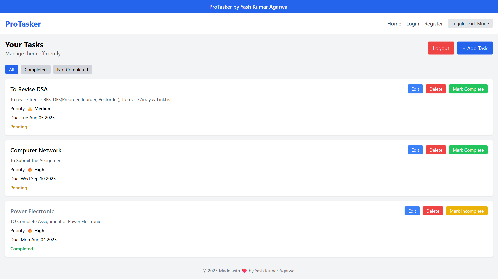
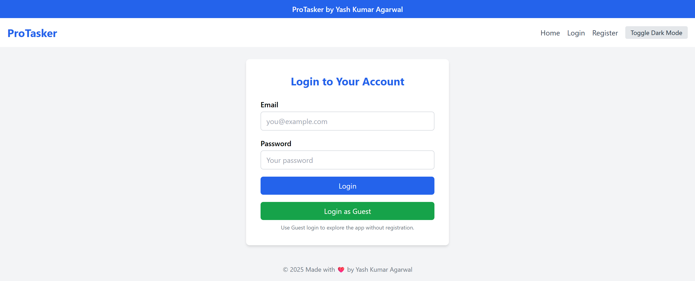
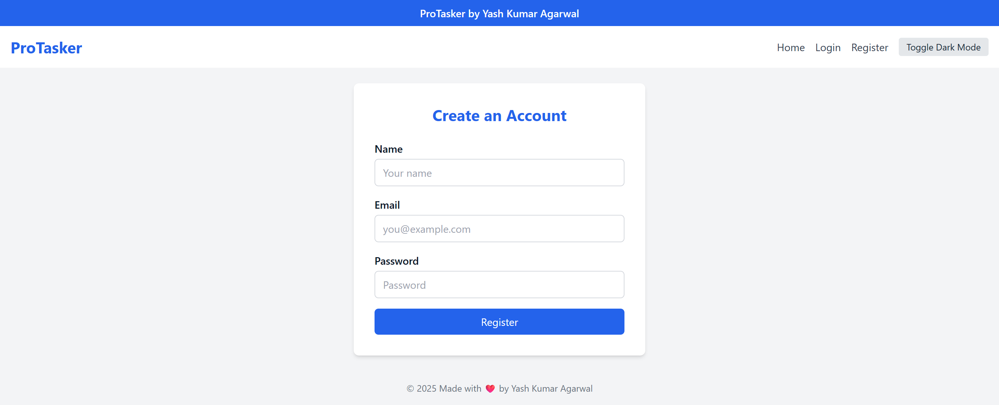
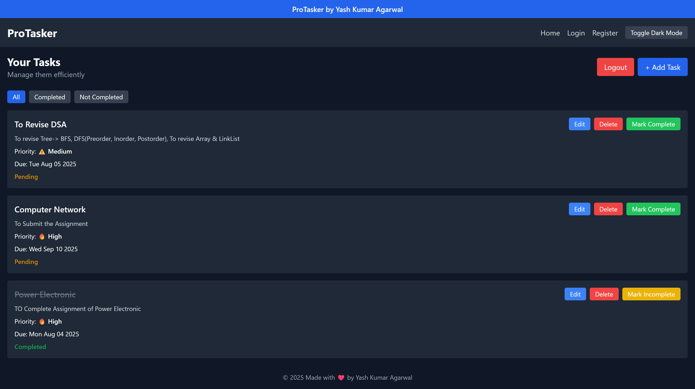
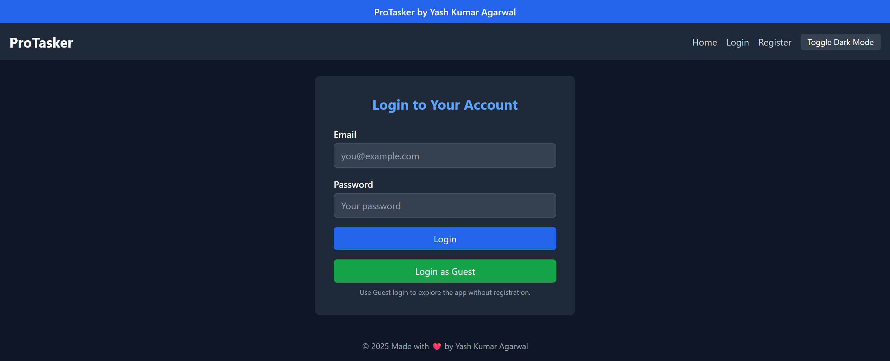
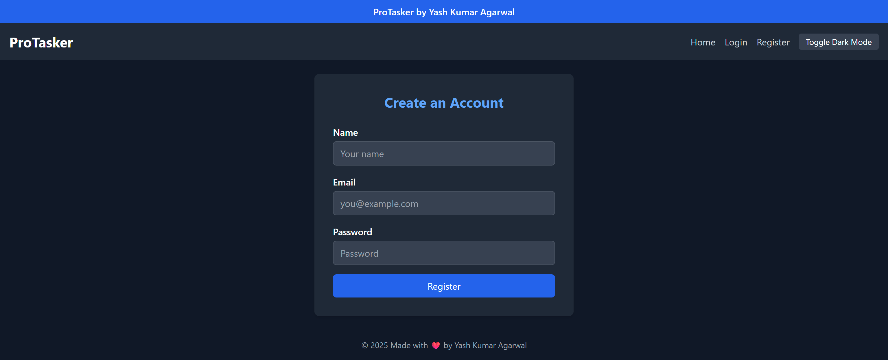

# ProTasker ✅

A full-stack task manager app built with **React**, **Node.js**, **Express**, and **MongoDB**. Designed to help users manage their daily tasks with priorities, deadlines, and completion status—complete with a responsive UI and dark mode.

## 🔗 Live Demo

👉 [Try it here](https://pro-tasker-vert.vercel.app/login)

Use Guest Login to explore:
- **Email:** `guest@gmail.com`
- **Password:** `guest123`

---

## ✨ Features

- ✅ Register/Login functionality with JWT-based authentication  
- 🧪 **Guest login** to explore the app without registration  
- 🔐 Protected routes (redirects to login if unauthenticated)  
- 📝 Create, edit, delete tasks  
- 📅 Set due date and priority (High/Medium/Low)  
- ✔️ Mark tasks as complete/incomplete  
- 🔍 Filter tasks: All | Completed | Not Completed  
- 🔽 **Smart Sorting**:  
  - ✅ "Not Completed" tasks are sorted by **due date**, then by **priority**  
  - ✅ **Completed** tasks are automatically moved to the **bottom**  
- 🌙 Dark mode toggle for better user experience  

---

## 📸 Screenshots

### 🌞 Light Mode

#### 🏠 Home Page  


#### 🔐 Login Page  


#### 📝 Register Page  


---

### 🌙 Dark Mode

#### 🏠 Home Page  


#### 🔐 Login Page  


#### 📝 Register Page  


---

## 🧱 Tech Stack

**Frontend:**
- React
- Tailwind CSS
- Axios
- Vite

**Backend:**
- Node.js
- Express
- MongoDB (via Mongoose)
- JWT for authentication

**Deployment:**
- Frontend: [Vercel](https://pro-tasker-vert.vercel.app)
- Backend: [Render](https://protasker-backend-no9g.onrender.com)

---

## 📂 Folder Structure

```bash
proTasker/
├── backend/
│   ├── models/
│   ├── routes/
│   ├── controllers/
│   └── server.js
├── frontend/
│   ├── src/
│   │   ├── components/
│   │   ├── pages/
│   │   ├── App.jsx
│   │   └── main.jsx
├── .env
├── README.md
```

---

## ⚙️ Installation & Setup (Local)

1. **Clone the repository**

```bash
git clone https://github.com/your-username/proTasker.git
cd proTasker
```

2. **Setup Backend**

```bash
cd backend
npm install
```

Create a `.env` file inside the `backend` folder:

```env
PORT=5000
MONGO_URI=your_mongo_uri
JWT_SECRET=your_jwt_secret
```

Start the backend server:

```bash
npm run server
```

3. **Setup Frontend**

Open a **new terminal** window:

```bash
cd frontend
npm install
```

Create a `.env` file inside the `frontend` folder:

```env
VITE_API_URL=http://localhost:5000
```

Start the frontend dev server:

```bash
npm run dev
```

Visit: `http://localhost:5173`

---

## 🙌 Acknowledgements

Made with ❤️ by **Yash Kumar Agarwal**


